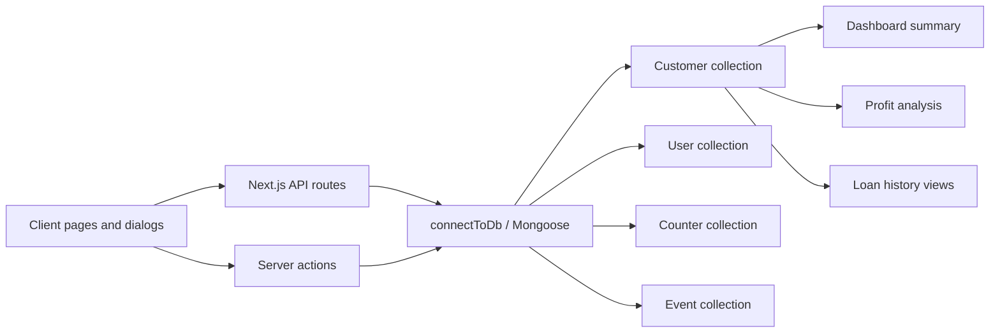

## Getting Started

First, run the development server:

```bash
npm run dev
# or
yarn dev
# or
pnpm dev
# or
bun dev
```

Open [http://localhost:3000](http://localhost:3000) with your browser to see the result.

You can start editing the page by modifying `app/page.tsx`. The page auto-updates as you edit the file.

# Data Flow Report

## Overview

This system is centered on a MongoDB-backed loan ledger. The main source of truth is the `Customer` document, which stores customer profile data, the active loan, payment transactions, and loan history in one record. Most of the application reads and writes that document directly through Next.js route handlers, while a few pages read MongoDB directly on the server.

The data flow is therefore document-centric rather than relational in the SQL sense:

1. UI pages call API routes or server actions.
2. API routes validate input, connect to MongoDB, and read or mutate Mongoose models.
3. Mongoose persists the changes into embedded MongoDB documents.
4. Dashboard and profit pages aggregate those same customer documents back into summary metrics.

## High-Level Flow



## Data Models

### Customer

The `Customer` model is the central loan record. It stores both current loan state and historical repayment data.

Fields:

| Field                     | Type   | Notes                                              |
| ------------------------- | ------ | -------------------------------------------------- |
| `customerId`              | Number | Sequential app-facing ID, unique and indexed       |
| `name`                    | String | Required, trimmed                                  |
| `contact`                 | String | Required, unique, indexed, must match `^0\d{9}$`   |
| `address`                 | String | Required, trimmed                                  |
| `loanAmount`              | Number | Required, minimum 0                                |
| `interestRate`            | Number | Required, minimum 0                                |
| `duration`                | Number | Required, minimum 1                                |
| `totalWithInterest`       | Number | Required, stored total payable                     |
| `monthlyPayment`          | Number | Required                                           |
| `dailyPayment`            | Number | Required                                           |
| `paidAmount`              | Number | Defaults to 0                                      |
| `transactions`            | Array  | Embedded payment transactions for the current loan |
| `loanHistory`             | Array  | Embedded snapshots of previous loans               |
| `createdAt` / `updatedAt` | Date   | Added by Mongoose timestamps                       |

Nested transaction shape:

| Field    | Type   | Notes                          |
| -------- | ------ | ------------------------------ |
| `amount` | Number | Required                       |
| `date`   | Date   | Defaults to now                |
| `note`   | String | Defaults to `Payment received` |

Nested loan snapshot shape:

| Field               | Type   | Notes                                  |
| ------------------- | ------ | -------------------------------------- |
| `loanAmount`        | Number | Required                               |
| `interestRate`      | Number | Required                               |
| `duration`          | Number | Required                               |
| `totalWithInterest` | Number | Required                               |
| `monthlyPayment`    | Number | Required                               |
| `dailyPayment`      | Number | Required                               |
| `paidAmount`        | Number | Defaults to 0                          |
| `transactions`      | Array  | Payment history captured for that loan |
| `status`            | String | `ongoing` or `completed`               |
| `openedAt`          | Date   | Loan start timestamp                   |
| `closedAt`          | Date   | Loan end timestamp when complete       |

### Counter

The `Counter` model stores a single sequence document used to generate customer IDs.

| Field  | Type   | Notes                                       |
| ------ | ------ | ------------------------------------------- |
| `name` | String | Unique counter name, currently `customerId` |
| `seq`  | Number | Current sequence value                      |

### User

The `User` model supports authentication and role-based access.

| Field      | Type   | Notes                     |
| ---------- | ------ | ------------------------- |
| `username` | String | Unique, required, trimmed |
| `password` | String | Hashed with bcrypt        |
| `role`     | String | `admin` or `officer`      |

### Event

The `Event` model is a separate feature, backed by its own collection.

| Field         | Type   | Notes           |
| ------------- | ------ | --------------- |
| `eventName`   | String | Required        |
| `eventDate`   | Date   | Required        |
| `eventTime`   | String | Required        |
| `location`    | String | Required        |
| `description` | String | Optional        |
| `createdAt`   | Date   | Defaults to now |

## MongoDB Relationships And Sync

There are no foreign-key style references between collections. Instead, the application uses a mix of embedded documents and independent collections:

1. `Customer` is the root document for the loan domain.
2. `transactions` are embedded inside `Customer`, so every payment update rewrites that customer document.
3. `loanHistory` is also embedded inside `Customer`, which lets the app preserve completed loans without moving them to another collection.
4. `Counter` is a helper collection used only to generate sequential `customerId` values.
5. `User` is independent and only used for login and role checks.
6. `Event` is independent and managed by server actions rather than API routes.

MongoDB sync happens through Mongoose:

1. `connectToDb()` caches the Mongoose connection on `globalThis` and reuses it across requests.
2. Every route handler or server action calls `connectToDb()` before querying.
3. `Customer.create()` triggers the pre-save hook that assigns a new `customerId` from `Counter`.
4. `findOneAndUpdate()` and `findOneAndDelete()` mutate or remove the document directly in MongoDB.
5. `customer.save()` is used when a nested array or computed total needs to be persisted after in-memory mutation, especially for payments.
6. `backfillCustomerIds()` repairs older customer records that were missing `customerId`, then advances the counter so new IDs do not collide.

Important implementation note: the `customerId` assignment runs in the `Customer` pre-save hook, so it applies on creates and on any path that ends in `save()`. Direct `findOneAndUpdate()` calls do not rely on that hook.

## CRUD Operations

### Customer Create

Entry point: `POST /api/customers`

Client flow:

1. `AddCustomerDialog` collects name, contact, address, loan amount, interest rate, and duration.
2. The dialog calls `GET /api/customers/next-id` to preview the next sequential customer number.
3. It calculates `totalWithInterest`, `monthlyPayment`, and `dailyPayment` locally and sends them with the form payload.

Server flow:

1. The handler normalizes the phone number and validates it against the `0XXXXXXXXX` format.
2. Numeric fields are converted with `Number(...)` and rejected if invalid.
3. If the client omits the derived values, the server recalculates them.
4. `connectToDb()` is called.
5. `backfillCustomerIds()` runs before insertion so the counter is aligned with existing data.
6. `Customer.create()` writes the new document.
7. The pre-save hook assigns a new `customerId` from the counter collection.
8. The response serializes the document and returns the public-facing `id` and MongoDB `_id` as `mongoId`.

### Customer Read

Entry points:

1. `GET /api/customers`
2. `GET /api/customers/[id]`
3. Server-side read in `app/(dashboard)/customers/[id]/page.tsx`

List endpoint behavior:

1. If `identifier` is provided, the handler first tries `customerId`, then falls back to contact lookup.
2. If `search` is provided, the handler searches by `customerId`, `name`, `contact`, or `address`.
3. Results are sorted by `createdAt` descending.
4. Every result is serialized into a UI-friendly object.

Detail endpoint behavior:

1. The route validates the numeric ID.
2. It looks up the customer by `customerId`.
3. It returns the serialized customer document, including `loanHistory` and timestamps.

Server component behavior:

1. The customer detail page queries MongoDB directly with `Customer.findOne({ customerId })`.
2. It computes derived values such as remaining balance, repayment progress, and expected finish date.
3. It renders the current loan plus the embedded loan history without going through an API route.

### Customer Update

Entry point: `PUT /api/customers/[id]`

There are two update modes.

#### General update

Used when editing customer profile or loan fields.

1. The handler validates the customer ID.
2. If a new contact number is supplied, it is normalized and validated.
3. Only provided fields are included in the update object.
4. `Customer.findOneAndUpdate()` writes the changes and returns the updated document.

#### New loan rollover

Triggered when `body.newLoan` is true.

1. The server checks that the previous loan is fully paid.
2. If any balance remains, the request is rejected.
3. The new loan amount, interest rate, and duration are validated.
4. The existing active loan is converted into a loan history snapshot.
5. The current document is overwritten with the new loan values.
6. `paidAmount` is reset to 0 and `transactions` is cleared for the new loan.
7. The previous loan is appended to `loanHistory`.

Client flow:

1. `AddLoanDialog` sends `PUT /api/customers/[id]` with `newLoan: true`.
2. The page refreshes after a successful rollover.

### Customer Delete

Entry point: `DELETE /api/customers/[id]`

1. The handler validates the customer ID.
2. It deletes the customer by `customerId` using `findOneAndDelete()`.
3. Because transactions and loan history are embedded, deleting the customer removes the entire loan record in one operation.

Client flow:

1. `DeleteCustomerDialog` confirms the action.
2. It calls the DELETE route.
3. On success, it navigates back to the customer list and refreshes the UI.

### Payment Create

Entry point: `POST /api/customers/[id]/payments`

1. The handler validates the customer ID.
2. It requires a positive payment amount.
3. The customer is loaded from MongoDB.
4. `paidAmount` is incremented by the new amount.
5. A new embedded transaction is pushed into `transactions`.
6. `customer.save()` persists both the updated total and the new transaction entry.

Client flows:

1. The collections page adds a payment through the global payment dialog.
2. The customer detail page and collections table both show the updated balance after refresh.

### Payment Update

Entry point: `PUT /api/customers/[id]/payments`

1. The handler validates the customer ID and the positive payment amount.
2. It ensures the customer has at least one transaction.
3. The requested transaction index is selected, or the last transaction is used by default.
4. That embedded transaction is replaced with the corrected amount/date/note.
5. `paidAmount` is recomputed from the full transaction array so the total stays in sync.
6. `customer.save()` persists the corrected ledger.

Client flow:

1. The collections page opens an edit dialog for a transaction.
2. It sends the corrected payment to the PUT payment route.
3. The table reloads after the save succeeds.

### Auth Flow

#### Login

Entry point: `POST /api/auth/login`

1. The handler reads username and password.
2. It looks up the user by normalized username.
3. It compares the password with bcrypt.
4. If valid, it signs a JWT with the user ID as the subject and `username` / `role` as payload claims.
5. The token is stored in an httpOnly cookie named `loanflow_session` for 7 days.

#### Register And User Listing

Entry point: `GET /api/auth/register?role=officer` and `POST /api/auth/register`

1. `GET` is restricted to admins and returns matching users, optionally filtered by role.
2. `POST` creates a user after hashing the password.
3. The first user must be an admin.
4. After the system already has users, only authenticated admins can create more users.

#### Me And Logout

1. `GET /api/auth/me` reads the auth cookie and returns the decoded session user.
2. `POST /api/auth/logout` clears the auth cookie.

### Events

Event CRUD is implemented as server actions rather than API routes.

1. `addEvent(formData)` creates and saves a new `Event` document.
2. `getAllEvents()` returns all events.
3. `getEventById(eventId)` fetches one event by MongoDB ObjectId.
4. `updateEvent(eventId, formData)` updates the event document and returns the new version.
5. `deleteEvent(eventId)` removes the event document.

## API Calls From The UI

| UI Surface             | API Call                              | Purpose                                               |
| ---------------------- | ------------------------------------- | ----------------------------------------------------- |
| Login page             | `POST /api/auth/login`                | Authenticate the user and set the session cookie      |
| Customers page         | `GET /api/customers?search=...`       | Load and search customers                             |
| Add Customer dialog    | `GET /api/customers/next-id`          | Preview the next sequential customer number           |
| Add Customer dialog    | `POST /api/customers`                 | Create a new customer and initial loan                |
| Collections page       | `GET /api/customers?identifier=...`   | Find a customer by customer ID or phone number        |
| Collections page       | `POST /api/customers/[id]/payments`   | Add a payment transaction                             |
| Collections page       | `PUT /api/customers/[id]/payments`    | Edit a payment transaction                            |
| Add Loan dialog        | `PUT /api/customers/[id]`             | Roll a fully paid customer into a new loan            |
| Customer delete dialog | `DELETE /api/customers/[id]`          | Remove the customer and all embedded loan data        |
| Dashboard page         | `GET /api/dashboard/summary`          | Fetch dashboard totals and recent transactions        |
| Profits page           | `GET /api/dashboard/profits?...`      | Fetch profit rows and summary totals for a date range |
| Settings page          | `GET /api/auth/register?role=officer` | Load officers list                                    |
| Settings page          | `POST /api/auth/register`             | Create a collection officer                           |

Some pages do not use the API layer for reads. The customer detail page performs a direct server-side MongoDB query, which keeps the page fast and avoids an extra HTTP hop.

## Calculation Logic And Formulas

### Customer Loan Calculations

The same derived values are calculated in both the add-customer UI and the customer routes.

#### Total payable amount

Implemented formula:

$$
\text{totalWithInterest} = \text{loanAmount} + \text{loanAmount} \times \frac{\text{interestRate}}{100} \times \text{duration}
$$

This is equivalent to:

$$
\text{totalWithInterest} = \text{loanAmount} \times \left(1 + \frac{\text{interestRate} \times \text{duration}}{100}\right)
$$

#### Monthly payment

$$
\text{monthlyPayment} = \frac{\text{totalWithInterest}}{\text{duration}}
$$

#### Daily payment

$$
\text{dailyPayment} = \frac{\text{totalWithInterest}}{\text{duration} \times 30}
$$

#### Remaining balance

$$
\text{remaining} = \max(\text{totalWithInterest} - \text{paidAmount}, 0)
$$

#### Loan status

If `remaining > 0`, the loan is `ongoing`. Otherwise it is `completed`.

#### Repayment progress

$$
\text{percentPaid} = \text{round}\left(\frac{\text{paidAmount}}{\text{totalWithInterest}} \times 100\right)
$$

The UI clamps this value to the range $0$ to $100$.

### Dashboard Summary Formulas

The dashboard summary route scans all customers and derives portfolio-wide metrics.

#### Total loan given

$$
\text{totalLoanGiven} = \sum \text{loanAmount}
$$

#### Total collected

$$
\text{totalCollected} = \sum \text{paidAmount}
$$

#### Pending loan balance

$$
\text{pendingLoan} = \sum \max(\text{totalWithInterest} - \text{paidAmount}, 0)
$$

#### Active customers

Count customers where `remaining > 0`.

#### Monthly loan given

Sum `loanAmount` for customers whose `createdAt` falls inside the current month.

#### Monthly collected

Sum payment transaction amounts whose transaction date falls inside the current month.

#### 7-day and 30-day collections

Sum payment transaction amounts whose date is in the last 7 or 30 days.

### Profit Formulas

Profit is derived from collected payments rather than from the full principal.

#### Per-payment profit

Implemented formula:

$$
\text{profit} = \left(\frac{\text{paymentAmount}}{100 + \text{interestRate}}\right) \times \text{interestRate}
$$

This is mathematically equivalent to:

$$
\text{profit} = \text{paymentAmount} \times \frac{\text{interestRate}}{100 + \text{interestRate}}
$$

The dashboard summary and the profit analysis route both use this approach.

### Profit Analysis Filters

The profit route supports four date filters:

1. `today` - start of today to end of today.
2. `last7days` - the last 7 calendar days including today.
3. `custom` - a user-provided start and end date.
4. `monthly` - a specific year-month pair.

For each matching transaction, the route emits a profit row with customer ID, customer name, payment amount, interest rate, profit, date, and loan status.

### Loan History And Ledger Views

The customer detail page and loans page derive additional views from the same stored arrays:

1. The current loan is reconstructed from the customer root fields.
2. Completed loans are read from `loanHistory`.
3. The collections page can flatten all transactions across customers into a single ledger.
4. The customer detail page builds a daily ledger from `createdAt` to today by grouping transactions per day.

## Request Protection And Session Flow

Route protection is handled by `proxy.ts` before requests reach the app.

1. Static assets and `/api/*` requests are allowed through.
2. Public pages such as `/` and `/login` are allowed without a session.
3. Unauthenticated users are redirected to `/` when they try to access protected pages.
4. Authenticated users are redirected away from public pages to their landing area.
5. Officers are restricted to `/collections` and nested collection routes.

This means access control is enforced both at the edge and again inside the auth-sensitive API handlers.

## Summary

The system stores the active loan, payment ledger, and historical loans in one `Customer` document and uses that document as the source for nearly every read and write path. Sequential customer IDs come from the `Counter` collection, authentication comes from the `User` collection and a JWT cookie, and dashboard/profit reporting is computed by aggregating the same customer records back into summary views.
